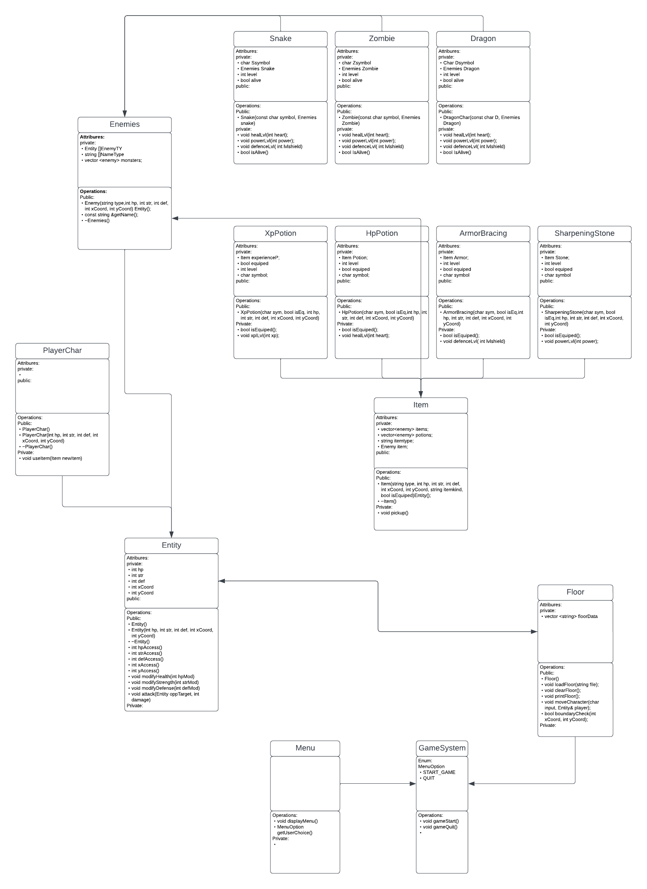

# Dungeon Hero a Roguelike Game
 > Authors: [Brandan Lee](https://github.com/TwentyLives), [Alex Hsu](https://github.com/Ahsu055), [Byron Rios](https://github.com/br26244), [Neel Parekh](https://github.com/np2400)

## Project Description

 #### Intrest/Importance

This project is an early 80’s stylized exploration terminal based game, with an emphasis on user exploration and personal choice in actions.  Interactive media provides a medium of entertainment for an audience of individuals who wish to participate in similar stylized tabletop games, but with a wider accessibility in mind. This project will focus on the development of user interaction with programmed opposition and planned/designed board layout. This project is meant to represent the opportunities of which interactive media such as video games, can offer to an audience of individuals who desire an easily accessible, short, yet captivating experience, for entertainment.

 #### languages/tools/technologies

[C++](https://www.cplusplus.com/): Our project's primary language will be C++

[Visual Studio Code](https://code.visualstudio.com/): Visual Studio Code will be used as a texteditor as well as a terminal to test code

[Git](https://git-scm.com/): Git is used to make edits to our Github repository

[Valgrind](https://valgrind.org/): Valgrind is a tool that is used to detect errors in memory for code

[Github](https://github.com/): Github is a version control system that allows users to work together on shared code. Github also includes a project board for organizing implementations

[Lucidchart](https://www.lucidchart.com/): Ludichart is a software allows easy diagram

[CMake](https://cmake.org/): CMake allows simple and fast compiling of code

[Google Test Framework](https://github.com/google/googletest): Google made tools that allows for testing of code

 #### input/output

 Inputs - The user will be able to create a new character and design their stats based upon a series of random questions. Once starting the game, the player will be able to navigate these dungeon floors using either a combination of wasd or arrow keys as well as turn based prompts when encountering any interaction between enemies and/or objects within the room through a series of text menus.

 Outputs - The program will print out a dungeon map layout using ascii characters as well as the playable character and interactable objects within said dungeon.There will be a menu for intractable options as well as a sub bar to view player stats and inventory throughout the game.

 #### Features

 Our project is a terminal based video game, with user customization and personal user choices in mind. This game will have users choose from a series of preset background stories that could be mixed and matched to create a new experience every time the user decides to play it again. Each personal choice affects the user’s outcome, including their virtual characters strengths and weaknesses. After making their choice in character, the user will be placed into the game environment filled with varied enemy opposition, programmed to be diverse in outcomes. The user’s objective is to complete as many floors as possible, with a personal scoreboard marking the amount of floors completed, to incentivise personal competitiveness. Upon defeat however, the user’s score will be registered, and will have to start over, with the objective of beating their own score.
 
## User Interface Specification

### Navigation Diagram

The main menu of the game where the player has two options to start and quit the game. The player clicks the start button to begin which takes them to the character customization screen. After customizing the character,the player can click the confirm button to proceed to the actual game. The player can now play the game and when the player dies they face permadeath and the player must start a new game or restart it.

Navigation diagram can be found [by clicking this link](DesignDocs/Navigational_Diagram.pdf)

### Screen Layouts

The main menu of our program can be used to access the game via the start button. This will show a character custimization menu. Once completing this it will move onto the game screen. The game's interactables are the wasd keys to move around the map as well as the space key to interact with enemies, interactable, and moving onto the next floors. The screen will change in response to what the player is doing. For example, getting hit will cause a decrease in health or completing a level will cause the floor to say 2.

Screen layout can be found [by clicking this link](DesignDocs/Screen_Layouts.pdf)

## Class Diagram

The Enemy class is an inherited class of the base class Entity. It inherits the object into types of health, strength, defense, alongside  x and y coordinates. The Enemy class is meant to store the enemies objects in the game which includes snakes, zombies, and dragons. Each enemy type is an inherited class that inherits the Enemy class, and the entity class. Within the snake, zombie and dragon class, each constructor sets the level, health, strength and defense of each monster, alongside its coordinates. Moreover, within the constructor, bool alive is defined as true, however, is changed to false once the health of the monster enemy reaches zero. The function IsAlive, determines whether the monster type is alive or not. If health reaches zero, then the alive object is changed to false. Enemy types are stored in a vector, which all hold the separate status of the enemies. Each enemy type gets a vector, allowing for easier organization. Each enemy has a level, which modifies the preset statistics of its character. For example, a level 10 snake will additively do more damage than a level 1 snake. This modification of predetermined character statistics is done through the “lvl” functions which modify the effect enemies have on the player user with correlation to their level. Finally the Enemy class features a deconstructor, which will thoroughly delete all enemy and empty vector item’s types stored in the vector. 

Moreover, the item class is an inheritance class from both enemies and entities, and has two separate vectors (items, potions)  allowing for easier organization when it comes to the two different types of items. Momentary potions allow for the player's health or experience to grow. The other type of item inherited from the item class, are “items” or permanent increases to strength or defense. However, both potions or items share the same class functions. The level type object in one of the item inheritance classes, allows for the modification of the object's properties. For example, a level 1 health potion will restore significantly less health in comparison to a level 10 potion. This modification is done through the “lvl” functions, which modify the effects of what each item does to the player in correlation to the level of the item.Finally the Item class features a deconstructor, which will thoroughly delete all item types stored in the vector
 
 > ## Phase III
 > You will need to schedule a check-in for the second scrum meeting with the same reader you had your first scrum meeting with (using Calendly). Your entire team must be present. This meeting will occur on week 8 during lab time.
 
 > BEFORE the meeting you should do the following:
 > * Update your class diagram from Phase II to include any feedback you received from your TA/grader.
 > * Considering the SOLID design principles, reflect back on your class diagram and think about how you can use the SOLID principles to improve your design. You should then update the README.md file by adding the following:
 >   * A new class diagram incorporating your changes after considering the SOLID principles.
 >   * For each update in your class diagram, you must explain in 3-4 sentences:
 >     * What SOLID principle(s) did you apply?
 >     * How did you apply it? i.e. describe the change.
 >     * How did this change help you write better code?
 > * Perform a new sprint plan like you did in Phase II.
 > * You should also make sure that your README file (and Project board) are up-to-date reflecting the current status of your project and the most recent class diagram. Previous versions of the README file should still be visible through your commit history.
 
> During the meeting with your reader you will discuss: 
 > * How effective your last sprint was (each member should talk about what they did)
 > * Any tasks that did not get completed last sprint, and how you took them into consideration for this sprint
 > * Any bugs you've identified and created issues for during the sprint. Do you plan on fixing them in the next sprint or are they lower priority?
 > * What tasks you are planning for this next sprint.

 
 > ## Final deliverable
 > All group members will give a demo to the reader during lab time. ou should schedule your demo on Calendly with the same reader who took your second scrum meeting. The reader will check the demo and the project GitHub repository and ask a few questions to all the team members. 
 > Before the demo, you should do the following:
 > * Complete the sections below (i.e. Screenshots, Installation/Usage, Testing)
 > * Plan one more sprint (that you will not necessarily complete before the end of the quarter). Your In-progress and In-testing columns should be empty (you are not doing more work currently) but your TODO column should have a full sprint plan in it as you have done before. This should include any known bugs (there should be some) or new features you would like to add. These should appear as issues/cards on your Project board.
 > * Make sure your README file and Project board are up-to-date reflecting the current status of your project (e.g. any changes that you have made during the project such as changes to your class diagram). Previous versions should still be visible through your commit history. 
 
 ## Screenshots
 > Screenshots of the input/output after running your application
 ## Installation/Usage
 > Instructions on installing and running your application
 ## Testing
 > How was your project tested/validated? If you used CI, you should have a "build passing" badge in this README.
 
